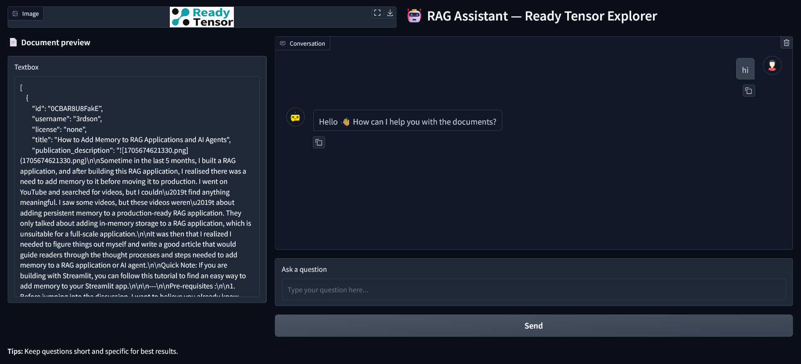

## <font color="chocolate">Ready-Tensor-Publication-Explorer-- RAG Chatbot </font>


## 📸 ⛶ Screenshot
**Chatbot demo answering questions**


    **Chatbot demo answering questions**


### ⚙️ Configuration

Create a `.env` file in the root with the following variables:

```env
GROQ_API_KEY=your_groq_api_key
OPENAI_API_KEY=your_openai_api_key
```
---


### Repository Structure
```
rag_assistant/
 ├─ data/
 │   ├─ project_1_publication.json
 │   ├─ raw/                # put source PDFs, txt, md, json
 │   └─ processed/          # normalized text, optional
 ├─ embeddings/             # persisted Chroma or FAISS db
 ├─ assets/                 # logos, images
 ├─ src/
 │   ├─ __init__.py
 │   ├─ config.py           # central settings (chunk, k, provider, model)
 │   ├─ loaders.py          # handles pdf, md, txt, json
 │   ├─ splitter.py         # text split logic
 │   ├─ embeddings.py       # embedder factory (HF/Gemini/OpenAI)
 │   ├─ vectordb.py         # Chroma / FAISS wrapper
 │   ├─ retriever.py
 │   ├─ prompts.py          # keep all prompt templates
 │   ├─ llm.py
 │   ├─ rag_chain.py
 │   └─ ui/                 # user interfaces
 │       ├─ cli.py
 │       └─ gradio_app.py
 ├─ ingest.py
 ├─ app.py                  # thin launcher for Gradio UI
 └─ tests/                  # add later (pytest)
 ├─ .env
 ├─ .env_example
 ├─ README.md
 ├─ requirements.txt
```
---

```Python
// This is a code block
const a = 1;
```


## Reference
I will copy my publication link here

## Contact: 
abdid.yadata@gmail.com